# PolyU AAE6102 Assignment 1 Report

## Task 1 - Acquisition

Signal acquisition aims to determine the visible satellites and estimate the coarse values of doppler frequency and code phase of the visible satellite signal. The processing details and results are listed as follows:

* The open-source software: [GNSS-SDR](https://gnss-sdr.org/) is used to acquire the provided two GPS L1 C/A signals.
* The configuration files used for signal acquisition are provided in:

    ```text
    assignment_1_gnss_sdr_acq_urban.conf
    assignment_1_gnss_sdr_acq_opensky.conf
    ```
    We set _Channels_1C.count=1_ and assign a specific satellite _Channel0.satellite=n_ to this channel. By this way, we can search a specific satellite at a time. Besides, we set _SignalSource.samples=4000000000/2000000000_ and _SignalSource.seconds_to_skip=20_ to only process 4000000000/2000000000 signal samples and skip the beginning 20 seconds. We design _Acquisition_1C.pfa=0.01_ to set the threshold. Various searching results will be saved during the whole acquisition process, particually, we only keep the last one. The signal acquisition process can be excuted by running the following two shell scripts:
    ```shell
    ./acquisition_urban_2.sh 
    ./acquisition_opensky_2.sh 
    ```
* Figure 1 and Figure 2 show the test statistics of all GPS satellites in the opensky environment and the urban environment, respectively. Obviously, the signal strengthes of the GPS PRN 4, 22, 26, 31 are relatively high in the opensky environment, while the signal strength of the GPS PRN 1 is extremely high in the urban environment.
    <center>
        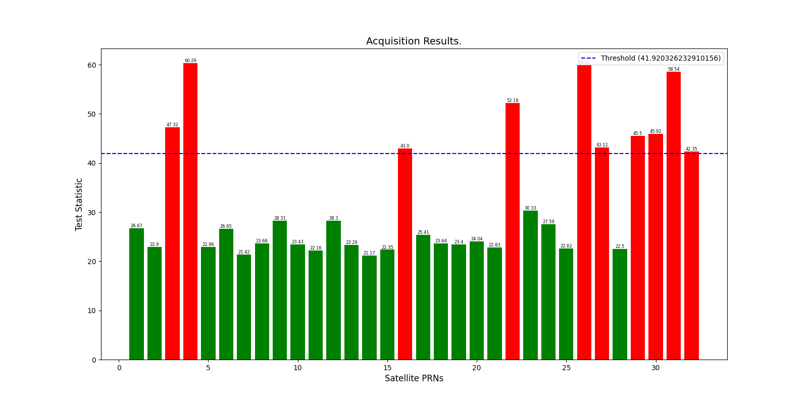
        <br>
        <div style="color:orange; border-bottom: 1px solid #d9d9d9;
        display: inline-block;
        color: #999;
        padding: 2px;">Figure 1. Test statistics of all GPS satellites in the opensky environment.</div>
    </center>
    <center>
        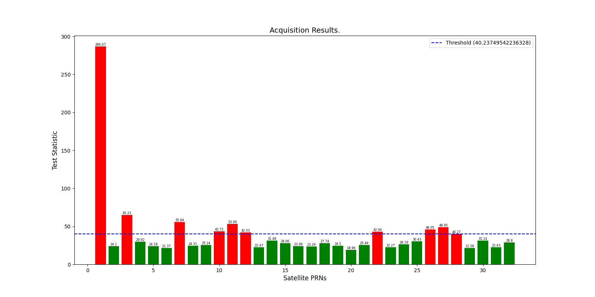
        <br>
        <div style="color:orange; border-bottom: 1px solid #d9d9d9;
        display: inline-block;
        color: #999;
        padding: 2px;">Figure 2. Test statistics of all GPS satellites in the urban environment.</div>
    </center>
* Figure 3 and Figure 4 present the estimated coarse doppler frequencies and code phases of all GPS satellites in opensky environment and urban environment, respectively.
    <center>
        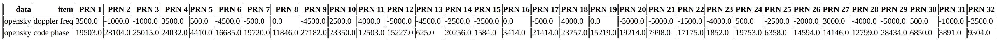
        <br>
        <div style="color:orange; border-bottom: 1px solid #d9d9d9;
        display: inline-block;
        color: #999;
        padding: 2px;">Figure 3. Estimated doppler frequencies and code phases of all GPS satellites in the opensky environment.</div>
    </center>
    <center>
        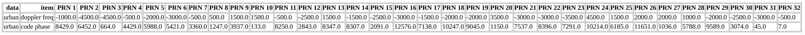
        <br>
        <div style="color:orange; border-bottom: 1px solid #d9d9d9;
        display: inline-block;
        color: #999;
        padding: 2px;">Figure 4. Estimated doppler frequencies and code phases of all GPS satellites in the urban environment.</div>
    </center>

    

## Task 2 - Tracking

Signal tracking aims to fine-tune the estimation of doppler frequency and code phase to an accurate level and obtain the carrier phase accurately at the same time. It typically involves Frequency-locked loop (FLL) for tracking carrier frequency, Phase-locked loop (PLL) for tracking carrier phase, and Delay lock loop (DLL) for tracking code phase. In this report, only tracking results and processing details of DLL are presented.

* [GNSS-SDR](https://gnss-sdr.org/) is used to track the provided two GPS L1 C/A signals.
* The configuration files used for signal tracking are provided in:
    ```text
    assignment_1_gnss_sdr_track_opensky.conf
    assignment_1_gnss_sdr_track_urban.conf
    ```
    We set _Channels_1C.count=1_ and assign a satellite with the highest signal strength and a satellite with relative weak signal to this channel (i.e., _Channel0.satellite=4_ and _Channel0.satellite=16_ for opensky, _Channel0.satellite=1_ and _Channel0.satellite=10_ for urban, respectively). The signal tracking process can be excuted by running the following commands in the terminal:
    ```shell
    gnss-sdr --config_file=./assignment_1_gnss_sdr_track_opensky.conf --log_dir=./log/tracking/opensky 
    gnss-sdr --config_file=./assignment_1_gnss_sdr_track_urban.conf --log_dir=./log/tracking/urban 
    ```
* Figure 5 and Figure 6 show the tracking results of DLL in the opensky environment, Figure 7 and Figure 8 show the tracking results of DLL in the urban environment. 
    <center>
        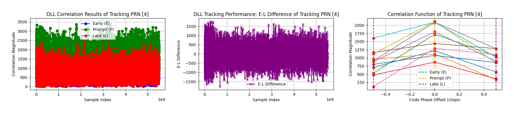
        <br>
        <div style="color:orange; border-bottom: 1px solid #d9d9d9;
        display: inline-block;
        color: #999;
        padding: 2px;">Figure 5. DLL correlation results in the opensky environment.</div>
    </center>
    <center>
        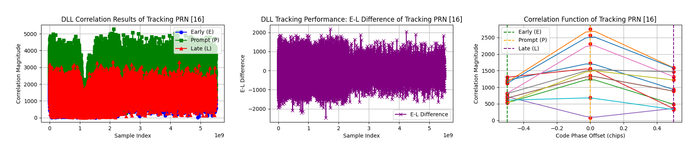
        <br>
        <div style="color:orange; border-bottom: 1px solid #d9d9d9;
        display: inline-block;
        color: #999;
        padding: 2px;">Figure 6. DLL correlation results in the opensky environment.</div>
    </center>
    <center>
        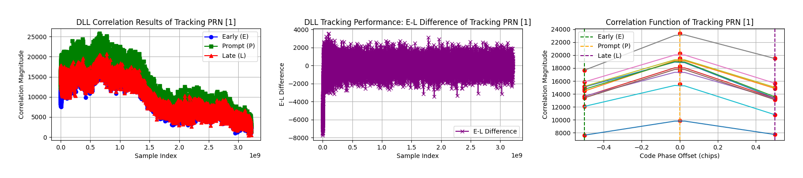
        <br>
        <div style="color:orange; border-bottom: 1px solid #d9d9d9;
        display: inline-block;
        color: #999;
        padding: 2px;">Figure 7. DLL correlation results in the urban environment.</div>
    </center>
    <center>
        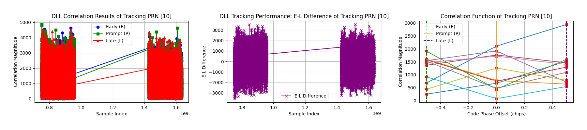
        <br>
        <div style="color:orange; border-bottom: 1px solid #d9d9d9;
        display: inline-block;
        color: #999;
        padding: 2px;">Figure 8. DLL correlation results in the urban environment.</div>
    </center>
* As shown in Figure 5-8 (Figure 5 vs. Figure 6, Figure 7 vs. Figure 8), weak GPS signal will reduce the performance of tracking loop.   
* When tracking a strong signal (Figure 5 vs. Figure 7), there are not significant difference in the DLL correlation peaks between the opensky environment and the urban environment.
* When tracing a weak signal (Figure 6 vs. Figure 8), urban interference will reduce the values of correlation peak and cause code phase correlation to be unstable.

## Task 3 - Navigation Data Decoding

Signal tracking makes sure the copied signal has the maximum correlation with the received signal. After that, we can demodulate the navigation data from the received GPS signals. The processing details and extracted ephemeris data are listed as follows:

* [GNSS-SDR](https://gnss-sdr.org/) is used to process the provided two GPS L1 C/A signals
* The configuration files used for demodulation are provided in:
    ```text
    assignment_1_gnss_sdr_decode_opensky.conf
    assignment_1_gnss_sdr_decode_urban.conf
    ```
* The extracted ephemeris data is shown in Figure 9 and Figure 10.
    <center>
        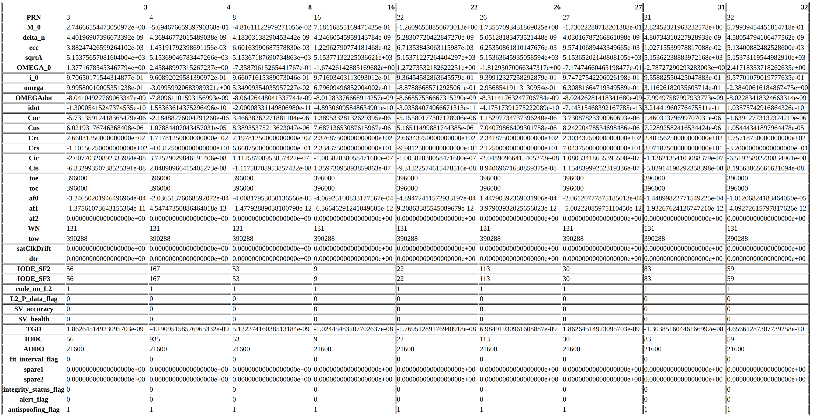
        <br>
        <div style="color:orange; border-bottom: 1px solid #d9d9d9;
        display: inline-block;
        color: #999;
        padding: 2px;">Figure 9. Ephemeris data in the opensky environment.</div>
    </center>
    <center>
        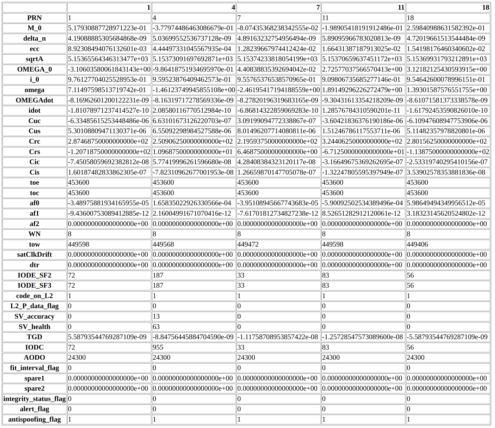
        <br>
        <div style="color:orange; border-bottom: 1px solid #d9d9d9;
        display: inline-block;
        color: #999;
        padding: 2px;">Figure 10. Ephemeris data in the urban environment.</div>
    </center>

## Task 4 - Position and Velocity Estimation

The details of implementation and estimated results are listed as follows:

* [GNSS-SDR](https://gnss-sdr.org/) is used to compute the position and velocity.
* The configuration files used are provided in:
    ```text
    assignment_1_gnss_sdr_els_opensky.conf
    assignment_1_gnss_sdr_els_urban.conf
    ```
    Specifically, [RTKLIB](https://www.rtklib.com/) positioning library is utilized to implement the Weighted Least Squares (WLS) algorithm in GNSS-SDR, we can set _PVT.positioning_mode=Single_ to call WLS for positioning. 
* The estimated positions, velocities, and positioning 2-D distance errors are shown in Figure 11 and Figure 12. 
    <center>
        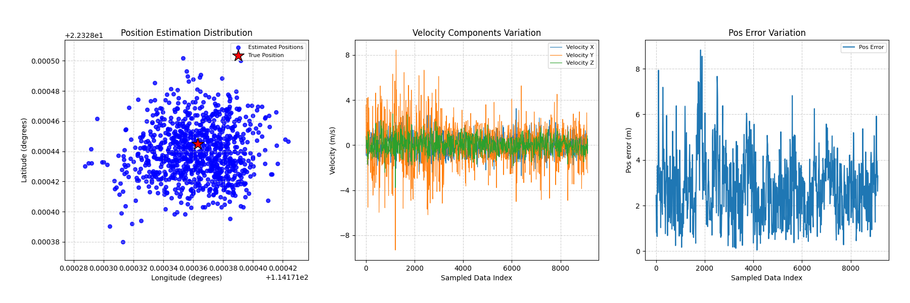
        <br>
        <div style="color:orange; border-bottom: 1px solid #d9d9d9;
        display: inline-block;
        color: #999;
        padding: 2px;">Figure 11. Estimated positions, velocities, and positioning errors via WLS in the opensky environment.</div>
    </center>
    <center>
        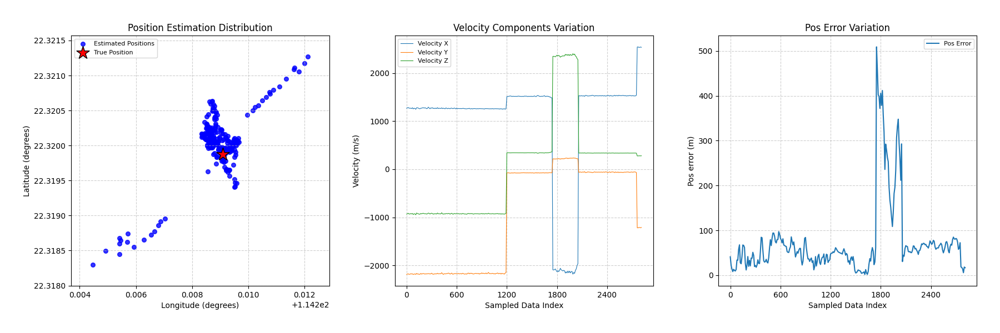
        <br>
        <div style="color:orange; border-bottom: 1px solid #d9d9d9;
        display: inline-block;
        color: #999;
        padding: 2px;">Figure 12. Estimated positions, velocities, and positioning errors via WLS in the urban environment.</div>
    </center>
* Comparing the positioning error shown in Figure 11 with that shown in Figure 12, we can find that the positioning error in the urban environment is significantly larger than that in the opensky environment, which discloses the challenges of accuracy positioning in urban environment with multipath effects and weak GPS signals. 
* Besides, the estimated velocities via WLS are exremely unaccuracy in the urban environment with the largest estimated velocity larger than 2000 m/s.

## Task 5 - Kalman Filter-Based Positioning

The details of implementation and estimated results are listed as follows:

* Similarly, [GNSS-SDR](https://gnss-sdr.org/) is used to compute the position and velocity.
* The configuration files used are provided in:
    ```text
    assignment_1_gnss_sdr_ekf_opensky.conf
    assignment_1_gnss_sdr_ekf_urban.conf
    ```
    Specifically, [RTKLIB](https://www.rtklib.com/) positioning library is utilized to implement the Extended Kalman Filter (EKF) algorithm in GNSS-SDR, we can set _PVT.positioning_mode=PPP_Static_ to call EKF for positioning. 
* The estimated positions, velocities, and positioning 2-D distance errors are shown in Figure 13 and Figure 14. Similar to the observations from Task 4, the positioning errors in the urban environment are larger than that in the opensky environment, although using EKF algorithm to estimate the positions.
    <center>
        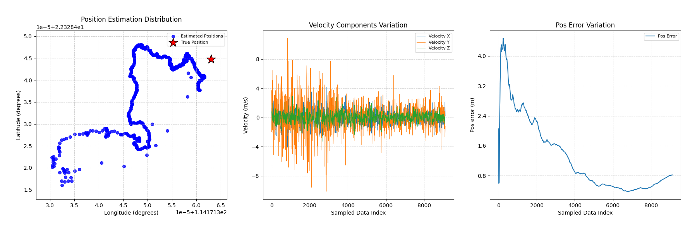
        <br>
        <div style="color:orange; border-bottom: 1px solid #d9d9d9;
        display: inline-block;
        color: #999;
        padding: 2px;">Figure 13. Estimated positions, velocities, and positioning errors via EKF in the opensky environment.</div>
    </center>
    <center>
        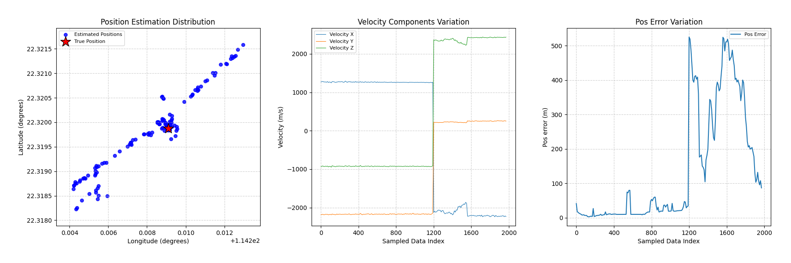
        <br>
        <div style="color:orange; border-bottom: 1px solid #d9d9d9;
        display: inline-block;
        color: #999;
        padding: 2px;">Figure 14. Estimated positions, velocities, and positioning errors via EKF in the urban environment.</div>
    </center>
* Figure 15 and Figure 16 show the positioning results using WLS and EKF in the opensky and urban, respectively. In the ideal environment (i.e., opensky, shown in Figure 15), the precision of estimated positions from EKF is higher than that from WLS, while in the urban environment (see Figure 16), there are no significantly difference between these two algorithms.
    <center>
        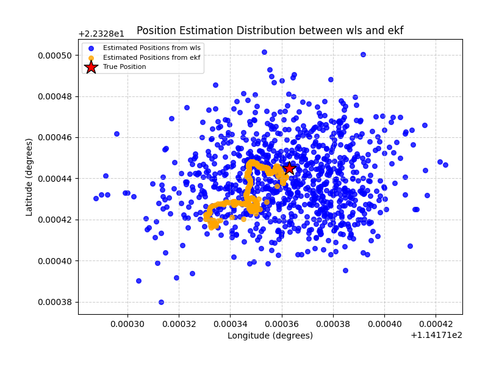
        <br>
        <div style="color:orange; border-bottom: 1px solid #d9d9d9;
        display: inline-block;
        color: #999;
        padding: 2px;">Figure 15. Estimated positions from WLS and EKF in the opensky environment.</div>
    </center>
    <center>
        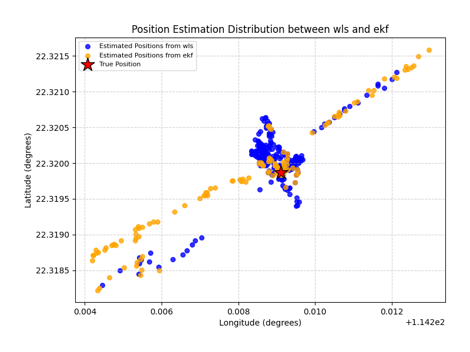
        <br>
        <div style="color:orange; border-bottom: 1px solid #d9d9d9;
        display: inline-block;
        color: #999;
        padding: 2px;">Figure 16. Estimated positions from WLS and EKF in the urban environment.</div>
    </center>