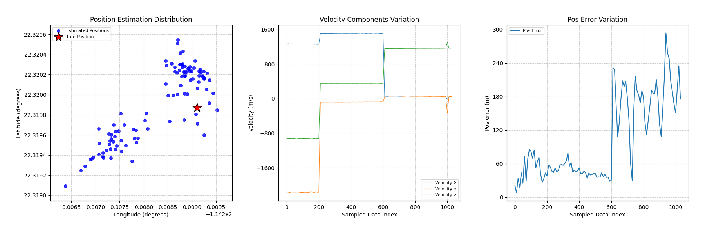

# PolyU AAE6102 Assignment 2 Report

## Task 1 - Differential GNSS Positioning
The pros and cons of the four GNSS techniques for smartphone navigation are presented as follows:
<table><tr><td bgcolor=Black>
<!-- <div style="border:2px solid #ddd; padding:10px; border-radius:20px;"> -->
The integration of Global Navigation Satellite Systems (GNSS) into smartphones has revolutionized personal and commercial navigation. However, as user expectations for precision grow, developers face the challenge of balancing technological performance with practical constraints like cost, power efficiency, and scalability. This essay compares four advanced GNSS algorithms (DGNSS, RTK, PPP, and PPP-RTK) across technological, economic, and operational dimensions to assess their suitability for smartphone navigation.

* **Technological Performance: Accuracy vs. Practicality**:
At the core of GNSS evolution is the pursuit of centimeter-level accuracy. RTK excels here, leveraging carrier-phase measurements and dense base station networks to achieve real-time precision. However, its limited coverage and reliance on infrastructure make it impractical for global smartphone use. PPP, in contrast, offers worldwide coverage using precise satellite orbit data and advanced error modeling, but its 30-minute initialization time frustrates users expecting instant results. DGNSS strikes a middle ground with meter-level accuracy and simplicity, though its dependency on single-station corrections reduces reliability. PPP-RTK merges PPP’s global reach with RTK’s real-time corrections, promising high accuracy without dense infrastructure. Yet, its algorithmic complexity and processing demands remain barriers for resource-constrained devices.

* **Infrastructure and Manufacturing Costs**:
Cost considerations are pivotal for mass-market devices. RTK’s reliance on dense reference stations drives up infrastructure expenses, while its hardware requirements (e.g., high-quality antennas) inflate smartphone manufacturing costs. DGNSS, with its mature technology and minimal infrastructure needs, is cost-effective but increasingly outdated. PPP reduces infrastructure dependency by utilizing global satellite data, lowering deployment costs, though high-precision clock and orbit data licensing may add expenses. PPP-RTK balances infrastructure needs but requires sophisticated software integration, potentially raising R&D costs. For smartphones, PPP and PPP-RTK offer scalable solutions if cloud-based correction services mitigate onboard processing needs.

* **Computational and Power Efficiency**:
Smartphones demand energy-efficient solutions. RTK’s continuous data processing significantly drains batteries, making it unsuitable for mobile devices. PPP’s lengthy initialization consumes power over extended periods, though once converged, its demands stabilize. DGNSS, with straightforward algorithms, imposes minimal computational load, preserving battery life. PPP-RTK’s hybrid approach risks higher power consumption due to real-time corrections and complex computations. Innovations in chipset efficiency and edge computing could alleviate these issues, but current hardware limitations favor DGNSS and PPP for energy-conscious designs.

* **Economic Viability and Market Readiness**:
Market adoption hinges on maturity and scalability. DGNSS is widely deployed but lags in accuracy, limiting its appeal for next-gen applications. RTK thrives in niche markets (e.g., surveying) but faces scalability challenges in consumer electronics due to high costs. PPP gains traction in high-end devices, aided by improving cloud-correction services that reduce initialization times. PPP-RTK, though promising, remains experimental, requiring industry collaboration to standardize correction formats and optimize algorithms. For smartphones, PPP’s incremental advancements offer a pragmatic path, while PPP-RTK represents a future-ready solution pending technological maturation.

No single algorithm perfectly satisfies all smartphone constraints, but a tiered approach could optimize user experience. For mainstream applications, PPP’s global coverage and moderate accuracy, coupled with cloud-assisted initialization, present a viable upgrade from DGNSS. Premium devices might adopt PPP-RTK as processing power improves, offering high accuracy without prohibitive infrastructure. Meanwhile, RTK remains confined to specialized use cases due to cost and power barriers. Manufacturers must prioritize energy efficiency, cost scalability, and user-centric design, ensuring that technological advancements align with practical realities. As GNSS evolves, the synergy between algorithmic innovation and hardware optimization will define the next era of smartphone navigation—where precision meets practicality.
</td></tr></table>
<!-- </div> -->

```
* GenAI model: DeepSeek R1.
* Prompt: "To improve the positioning accuracy of GNSS, several advanced algorithms have been developed. The core concepts and characteristics of these algorithms are presented below:

DGNSS (Differential GNSS)
1.1 Principle: Difference measurements from the same satellite between the receiver and a nearby base station. The base station transmits Pseudorange Corrections (PRC) to the receiver.
1.2 Advantages: Simple mathematical model; straightforward structure and algorithm; well-established technology.
1.3 Limitations: Only receives corrections from one reference station, reducing system reliability; restricted coverage area; meter-level accuracy.

RTK (Real-Time Kinematic)
2.1 Principle: Difference measurements between the base station and the receiver, and between different satellites in the same receiver.
2.2 Advantages: Centimeter-level accuracy.
2.3 Limitations: Limited service area; expensive implementation; operational constraints; requires dense reference station network; continuous data processing increases power consumption significantly compared to standard GNSS.

PPP (Precise Point Positioning)
3.1 Principle: Utilizes high-precision satellite orbit data, improved error modeling, and carrier-phase measurements to enhance positioning accuracy.
3.2 Advantages: Worldwide coverage; lower infrastructure requirements than RTK; better accuracy than DGNSS.
3.3 Limitations: Long initialization period (approximately 30 minutes); moderately lower accuracy and reliability compared to RTK; greater computational requirements; more complex algorithm.

PPP-RTK (Precise Point Positioning Real-Time Kinematic)
4.1 Principle: Combines the strengths of both RTK and PPP approaches.
4.2 Advantages: Provides real-time positioning across wide areas with high accuracy and reliability.
4.3 Limitations: Increased system complexity; demands greater processing capability.

When evaluating these GNSS algorithms for smartphone navigation applications, we must compare their benefits and drawbacks. The comparison should be summarized in an essay of approximately 700 words. Importantly, our comparison should adopt a multidimensional approach: not just examining the technological aspects, but also evaluating key product development considerations such as manufacturing costs, computational efficiency, power consumption, and economic viability. Now help me generate the essay:"
* Comments: DeepSeek R1 has strong reasoning capability and is free. 
```


## Task 2 – GNSS in Urban Areas
* **Satellite Visibility Analysis**

    To determine the visibility of GPS satellites in the given urban environment, we use [GNSS-SDR](https://gnss-sdr.org/) to process the raw IF data and generate observation and navigation data. The configuration file used is provided in:
    ```text
    assignment_2_gnss_sdr_obs_urban_gps.conf
    ```
    The generated observation and navigation data are stored in:
    ```text
    results/task_2/GSDR120q42.25O
    results/task_2/GSDR120q42.25N
    ```
    Next, we use RTKPlot to visualize the skyplot and skymask. Notably, we set the provided ground truth position (22.3198722, 114.209101777778, 3.0) as the receiver’s location to generate the skyplot. The resulting skyplot is shown in Figure 1. As observed, 6 satellites (G01, G03, G07, G11, G18, G22) are visible, but 4 of them are obstructed by surrounding buildings, presenting a significant challenge for high-precision positioning.
    <center>
        
        <br>
        <div style="color:orange; border-bottom: 1px solid #d9d9d9;
        display: inline-block;
        color: #999;
        padding: 2px;">Figure 1. The skyplot in the urban situation.</div>
    </center>

* **Positioning Performance Improvement**

    * Method Selection
        
        The most straightforward method to improve positioning in urban canyons is excluding the non-line-of-sight satellites. However, as shown in Figure 1, there are only two line-of-sight satellites, which is fewer than the minimum required for positioning. Therefore, we cannot directly exclude the non-line-of-sight satellites.

        Shadow matching is an effective method to improve positioning in urban canyons [2]. Its core idea is that satellites visible from different locations are predicted and compared with the measured satellite visibility to determine position. However, in this task, we only have the measured skymask information and cannot generate skymasks for other positions, so this method is not suitable for this task.

        Considering the recent 3D mapping-aided methods, like this proposed in [1], these methods typically require not only the skymask but also additional 3D information such as surrounding building heights. Since we only have the skymask, these methods cannot be used here.

        Given the above-mentioned limitations, we attempt to improve positioning performance by adjusting the parameters of the positioning algorithm provided in [GNSS-SDR](https://gnss-sdr.org/).

    * Processing Details

        Ionospheric and tropospheric delays introduce extra measurement errors in the signal travel time from satellites to receivers. Therefore, using appropriate ionospheric and tropospheric models can effectively correct positioning errors. In Assignment 1, we used the _Broadcast_ model for ionospheric correction and the _Saastamoinen_ model for tropospheric correction (as specified in the PVT Config section of _assignment_1_gnss_sdr_wls_urban.conf_). However, we identified a more precise tropospheric model: _Estimate_ZTD_Grad_. Consequently, we adopted _Estimate_ZTD_Grad_ model to enhance positioning performance.

        Additionally, [GNSS-SDR](https://gnss-sdr.org/) provides a Kalman filter-based denoising algorithm for processing measurements and estimations, which was not utilized in Assignment 1. We utilized this algorithm to further improve positioning accuracy.

        In summary, we modified two key settings to enhance positioning performance. The updated configuration file is available at:
        ```text
        assignment_2_gnss_sdr_pvt_urban_gps.conf
        ```
        The modified settings are:
        ```text
        PVT.trop_model=Estimate_ZTD_Grad
        PVT.enable_pvt_kf=true
        ```
        The estimated positions, velocities, and positioning 2-D distance errors using previous settings and improved settings are shown in Figure 2 and Figure 3, respectively. Figure 4 compares the position estimates using the original and improved settings (blue points vs. orange points). As shown, the refined settings provide modest but noticeable improvements in positioning accuracy and precision for urban environments.
        <center>
            
            <br>
            <div style="color:orange; border-bottom: 1px solid #d9d9d9;
            display: inline-block;
            color: #999;
            padding: 2px;">Figure 2. Estimated positions, velocities, and positioning errors in the urban environment presented in Assignment 1.</div>
        </center>
        <center>
            
            <br>
            <div style="color:orange; border-bottom: 1px solid #d9d9d9;
            display: inline-block;
            color: #999;
            padding: 2px;">Figure 3. Estimated positions, velocities, and positioning errors in the urban environment using improved settigns.</div>
        </center>
        <center>
            
            <br>
            <div style="color:orange; border-bottom: 1px solid #d9d9d9;
            display: inline-block;
            color: #999;
            padding: 2px;">Figure 4. Estimated positions from previous settings and improved settings in the urban environment.</div>
        </center>


    * References
        
        [1] A Computation Effective Range-based 3D Mapping Aided GNSS with NLOS Correction Method , Hoi-Fung Ng et al., The Journal of Navigation, 2020.

        [2] GNSS Shadow Matching: Improving Urban Positioning Accuracy Using a 3D City Model with Optimized Visibility Scoring Scheme, Lei Wang et al., NAVIGATION: Journal of the Institute of Navigation, 2013.


## Task 3 – GPS RAIM (Receiver Autonomous Integrity Monitoring)

The details of implementation and estimated results are listed as follows:

* A RAIM FDE feature is provided in the PVT Configuration part of [GNSS-SDR](https://gnss-sdr.org/), we activated this feature to enable RAIM function.

* The configuration file used is available at:
    ```text
    assignment_2_gnss_sdr_pvt_opensky.conf
    ```
    Specifically, the item _PVT.enable_pvt_kf_ was set as _true_ to enable the RAIL feature.

* The estimated positions, velocities, and positioning 2-D distance errors from the method without RAIM and the method with RAIM are shown in Figure 5 and Figure 6.
        <center>
            
            <br>
            <div style="color:orange; border-bottom: 1px solid #d9d9d9;
            display: inline-block;
            color: #999;
            padding: 2px;">Figure 5. Estimated positions, velocities, and positioning errors in the opensky environment without RAIM.</div>
        </center>
        <center>
            
            <br>
            <div style="color:orange; border-bottom: 1px solid #d9d9d9;
            display: inline-block;
            color: #999;
            padding: 2px;">Figure 6. Estimated positions, velocities, and positioning errors in the opensky environment with RAIM.</div>
        </center>

* Figure 7 compares the position estimates without RAIM and with RAIM (blue points vs. orange points). As shown, the RAIM mechanism excluded some faulty measurements, resulting in fewer estimated points. When comparing the positioning results in Figure 5 with those in Figure 6, RAIM slightly reduces the estimated velocity error.
    <center>
        
        <br>
        <div style="color:orange; border-bottom: 1px solid #d9d9d9;
        display: inline-block;
        color: #999;
        padding: 2px;">Figure 7. Estimated positions without RAIM and with RAIM in the opensky environment.</div>
    </center>

## Task 4 – LEO Satellites for Navigation
The difficulties and challenges of using LEO communication satellites for GNSS navigation are discussed as below:
<table><tr><td bgcolor=Black>
The integration of Low Earth Orbit (LEO) satellites into Global Navigation Satellite Systems (GNSS) promises to address longstanding limitations of traditional medium-to-high Earth orbit constellations, such as weak signal strength and susceptibility to interference. However, leveraging LEO communication satellites for navigation (mainly through dedicated constellations, hybrid payloads, real-time orbit updates, or opportunistic signal use) introduces multifaceted technical and operational challenges. These hurdles must be carefully navigated to realize LEO’s potential as a GNSS enhancer.

* **Dedicated LEO Navigation Constellations: Scalability and Sustainability:**
Developing LEO-based navigation constellations presents significant technical barriers. Unlike traditional GNSS satellites, which provide wide coverage from high altitudes, LEO satellites operate closer to Earth (500–1,500 km), necessitating a larger constellation to ensure global coverage. For instance, while GPS requires 24 satellites, a LEO system might demand hundreds to maintain continuous visibility, dramatically increasing deployment and maintenance costs. Additionally, LEO satellites experience rapid orbital decay due to atmospheric drag, shortening their operational lifespan and requiring frequent replacements. This raises sustainability concerns, as frequent launches exacerbate space debris proliferation, demanding rigorous collision-avoidance systems. Operationally, coordinating a dedicated LEO constellation with existing GNSS infrastructure poses challenges. Spectrum allocation conflicts could arise, as LEO signals might interfere with legacy GNSS or communication bands. Regulatory frameworks, which vary globally, would need harmonization to avoid geopolitical disputes over orbital slots and frequency rights. Furthermore, the fast-moving nature of LEO satellites complicates ground station operations, necessitating dynamic tracking and handover mechanisms to maintain seamless user connectivity.

* **Integration of Navigation Payloads into LEO Communication Satellites: Design Compromises:**
Adding navigation capabilities to existing LEO communication satellites, such as Starlink or OneWeb, introduces technical trade-offs. Communication satellites prioritize high-throughput data transmission, leaving limited power, weight, and space for navigation payloads. Designing dual-purpose signals that serve both communication and positioning requires precise synchronization and signal integrity, as even minor phase errors could degrade navigation accuracy. Moreover, the signals must resist interference between communication and navigation functions, complicating waveform design. From an operational standpoint, satellite operators may prioritize their primary mission (e.g., broadband internet) over navigation performance. Navigation payloads could divert resources from core services, creating economic disincentives for operators. Additionally, the lack of standardization across LEO constellations complicates interoperability. For example, signals from different providers might use incompatible modulation schemes, forcing receivers to support multiple protocols and increasing complexity for end-users.

* **Real-Time Orbit Tracking and Updates: Infrastructure Demands:**
Using LEO satellites to enhance traditional GNSS through real-time orbit corrections requires ultra-precise tracking of both LEO and GNSS satellites. Technically, the rapid orbital motion of LEO satellites demands frequent positional updates, necessitating a dense global network of ground stations or inter-satellite laser links to ensure continuous monitoring. Processing this data in real time to generate GNSS corrections imposes immense computational burdens, requiring advanced algorithms and edge-computing infrastructure. Operationally, establishing such a system hinges on collaboration between GNSS operators and LEO satellite providers. Existing GNSS ground networks, optimized for high-altitude satellites, may lack the agility to track LEO trajectories. Furthermore, data-sharing agreements and cybersecurity protocols must be established to protect against vulnerabilities in real-time data streams. Without international cooperation, fragmentation in correction services could undermine the universality of GNSS enhancements.

* **Opportunistic Positioning: Signal Limitations and Legal Barriers:**
Extracting navigation observables from existing LEO communication signals (e.g., Doppler shifts from Starlink) faces inherent technical limitations. Communication signals lack the precise timing and structure required for navigation, making pseudorange measurements error-prone. While machine learning techniques could reverse-engineer positioning data from signal characteristics, this approach remains experimental and computationally intensive. Additionally, the dynamic LEO environment causes rapid signal availability changes, leading to positioning gaps in urban canyons or polar regions. Operationally, opportunistic use of LEO signals raises legal and ethical questions. Communication satellites transmit proprietary signals, and repurposing them for navigation without operator consent could violate intellectual property or licensing agreements. Regulatory bodies like the International Telecommunication Union (ITU) have not yet defined standards for dual-use signals, creating uncertainty. Moreover, reliance on third-party satellites introduces risks: operators could alter signal structures or prioritization, destabilizing navigation services.

* **Broader Challenges: Cybersecurity and Regulatory Uncertainty:**
Beyond method-specific issues, systemic challenges persist. The stronger LEO signals, while resistant to jamming, could become attractive targets for spoofing attacks, where malicious actors broadcast false signals to mislead receivers. Securing LEO-augmented GNSS demands robust encryption and authentication protocols, which are not universally implemented. Additionally, the regulatory landscape for LEO remains fragmented. Questions about liability for navigation failures, orbital debris mitigation, and spectrum rights remain unresolved, deterring investment.

While LEO satellites offer transformative potential for GNSS, their integration is far from straightforward. Each enhancement approach faces unique technical and operational hurdles. These range from hardware limitations and orbital dynamics to regulatory gaps and economic viability. Success will depend on interdisciplinary collaboration among engineers, policymakers, and industry stakeholders to standardize protocols, secure funding, and prioritize sustainability. Only then can LEO satellites evolve from a promising concept into a reliable pillar of global navigation.
</td></tr></table>

```
* GenAI model: DeepSeek R1.
* Prompt: "Traditional GNSS constellations operate in middle to high Earth orbits. This characteristic introduces several challenges for positioning and navigation, such as:
1. Satellite visibility: In urban areas or at high latitudes, receivers may experience inaccurate positioning or lose satellite lock.
2. Interference susceptibility: Long signal propagation paths increase vulnerability to disruptions from space weather, radiation belts, and atmospheric conditions.
3. Jamming susceptibility: GNSS signals weaken significantly by the time they reach receivers, making them relatively easy to jam.
4. Precise positioning: Orbital perturbations, space weather, and other factors introduce uncertainty in a satellite’s true position, degrading receiver accuracy.

In contrast, Low Earth Orbit (LEO) satellites are much closer to Earth than traditional GNSS satellites. Consequently, their signals experience less interference and attenuation, resulting in stronger and cleaner reception. This advantage positions LEO satellites as a potential enhancer of traditional GNSS performance. Generally, LEO can improve GNSS in several ways:
1. Developing dedicated LEO navigation constellations;
2. Integrating positioning payloads into existing LEO communication constellations;
3. Enhancing traditional GNSS by using LEO satellites for real-time orbit tracking and updates;
4. Leveraging opportunistic positioning by extracting navigation observables (e.g., Doppler shift, pseudorange, and carrier phase) from current LEO signals.

However, using LEO satellites for GNSS navigation also presents significant challenges. Write a short essay (about 700 words) to discuss the difficulties and challenges of using LEO communication satellites for GNSS navigation. As outlined above, LEO satellites can enhance GNSS in multiple ways, but each approach may face distinct challenges. Notably, these challenges can be examined from both technical and operational perspectives. Now help me generate the essay:"
* Comments: DeepSeek R1 has strong reasoning capability and is free. It is better to provide detailed backgrounds and instructions.
```

## Task 5 – GNSS Remote Sensing
The discussion of the impact of GNSS in seismology is presented as follows:
<table><tr><td bgcolor=Black>
In the realm of natural disaster mitigation, few technologies hold as much promise for seismology as Global Navigation Satellite Systems (GNSS). As a nation frequently challenged by seismic hazards, China stands at the forefront of integrating GNSS into earthquake science and disaster management. This technology, capable of measuring millimeter-to-centimeter-level ground displacements in real time, has reshaped how scientists, policymakers, and communities approach earthquake resilience. From advancing early warning systems to refining tectonic research, GNSS has emerged as a cornerstone of modern seismology, with profound implications for China’s societal safety, industrial innovation, and scientific leadership.  

* **Technological Advancements in Earthquake Monitoring**  
GNSS technology addresses a critical gap in traditional seismology: the ability to measure absolute ground displacement during seismic events. While conventional seismometers detect ground vibrations, they struggle to quantify permanent crustal movements—essential for understanding an earthquake’s magnitude and potential cascading hazards. In China, where densely populated urban centers and complex fault systems such as the Longmenshan and Xinjiang-Tibet regions pose significant risks, GNSS fills this void. Networks of continuously operating GNSS stations now supplement seismic arrays, offering real-time data on crustal deformation. This integration enables faster detection of earthquakes and more accurate modeling of fault slip dynamics, which are vital for early warning systems. By capturing the full spatial extent of deformation, GNSS-derived models also improve tsunami risk assessments along China’s eastern and southern coastlines, where subduction zone earthquakes could trigger catastrophic waves. Moreover, GNSS contributes to long-term tectonic studies. China’s vast and geologically diverse landscape, shaped by the collision of the Indian and Eurasian plates, requires continuous monitoring to assess strain accumulation along active faults. GNSS provides a cost-effective, high-resolution tool to map crustal motion over decades, revealing patterns that inform probabilistic earthquake forecasts. Such data are indispensable for regions like the North China Plain, where historical quakes underscore the urgency of understanding latent seismic threats.  

* **Societal Resilience and Public Safety**  
The societal implications of GNSS-driven seismology are particularly significant for China, where earthquakes threaten millions of lives and economic stability. By enhancing early warning systems, GNSS adds critical seconds—or even minutes—to evacuation timelines, reducing casualties in high-risk areas. This capability is vital for cities like Beijing, Chengdu, and Kunming, where rapid urbanization intersects with seismic vulnerability. Furthermore, GNSS aids in post-disaster response by mapping co-seismic deformation, guiding rescue operations, and assessing infrastructure damage. Beyond immediate disaster response, GNSS data inform land-use planning and building codes. In earthquake-prone provinces such as Sichuan and Yunnan, authorities leverage crustal deformation maps to restrict construction in high-risk zones and design resilient infrastructure. This proactive approach aligns with China’s national strategy to mitigate the cascading effects of earthquakes, from landslides to disrupted supply chains. Public trust in disaster management institutions is bolstered as GNSS transparency fosters confidence in risk communication, bridging the gap between scientific research and community preparedness.  

* **Industrial and Economic Implications**  
The adoption of GNSS in seismology has catalyzed growth in China’s geospatial technology sector. Domestic development of BeiDou, China’s indigenous GNSS, has not only reduced reliance on foreign systems but also spurred innovation in high-precision positioning hardware and software. Companies specializing in GNSS receivers, data analytics, and disaster management solutions are flourishing, driven by government investments in national security and smart city initiatives. This industrial boom creates jobs, fosters interdisciplinary collaboration, and positions China as a global leader in geospatial technologies. Additionally, GNSS integration with emerging technologies such as artificial intelligence (AI) and the Internet of Things (IoT) unlocks new possibilities. AI algorithms trained on GNSS data can identify subtle precursory signals of earthquakes, while IoT-enabled sensor networks enhance real-time monitoring in remote regions. These synergies elevate China’s technological ecosystem, attracting international partnerships and reinforcing its role in global seismic research initiatives.  

* **Challenges and Future Directions**  
Despite its advantages, GNSS adoption in seismology faces challenges. Dense station coverage remains uneven across China’s vast territory, limiting data resolution in rural and tectonically active border regions. Addressing this requires sustained investment in infrastructure and cross-border data-sharing agreements. Moreover, public awareness campaigns are needed to ensure communities understand and act on GNSS-based warnings. Looking ahead, China’s commitment to advancing GNSS applications signals a transformative era for seismology. Future developments may include miniaturized low-cost GNSS devices for widespread deployment, coupled with quantum-enhanced positioning systems for unprecedented accuracy. As the nation refines its disaster resilience framework, GNSS will remain integral to safeguarding lives, stabilizing economies, and advancing scientific inquiry.  
 
For China, the integration of GNSS into seismology represents more than a technological leap, it embodies a paradigm shift in disaster risk reduction. By bridging the gap between theoretical research and practical application, GNSS empowers scientists to decode the Earth’s movements, equips policymakers with actionable insights, and offers communities a lifeline in the face of uncertainty. As China continues to harness this technology, its contributions to global seismology will resonate far beyond its borders, setting a benchmark for resilience in an increasingly unpredictable world.
</td></tr></table>

```
* GenAI model: DeepSeek R1.
* Prompt: "Recently, advanced GNSS technologies have demonstrated significant potential in seismological applications. Typically, GNSS can be utilized in the following aspects:
1. Earthquake detection and monitoring: By providing absolute displacement measurements, GNSS can detect and monitor earthquake events during or after seismic activity. Additionally, GNSS enhances traditional seismic-based early warning systems by supplying rapid displacement data.
2. Crustal deformation and tectonic studies: GNSS enables continuous monitoring of crustal strain accumulation along fault lines.
3. Tsunami prediction: As tsunamis are generated by seafloor displacement, GNSS-derived coseismic slip models facilitate faster prediction of tsunami wave heights compared to traditional methods.

Clearly, GNSS has profound impacts on seismology. Particularly for China, as one of the countries most frequently affected by earthquakes, more effective means for earthquake warning, detection, monitoring, and research are critically needed. 

Next, please help me write a short essay (approximately 700 words) discussing the impact of GNSS on seismology. The discussion should primarily focus on China's perspective. Additionally, since the impacts can be multifaceted, you may explore various aspects, including potential effects on industry, society, and technological advancements. Now help me generate the essay,  try to avoid using data and examples as much as possible, and fabricating the data and examples is not allowed:"
* Comments: DeepSeek R1 has strong reasoning capability and is free. We particularly require the model to avoid forging data and instances.
```
